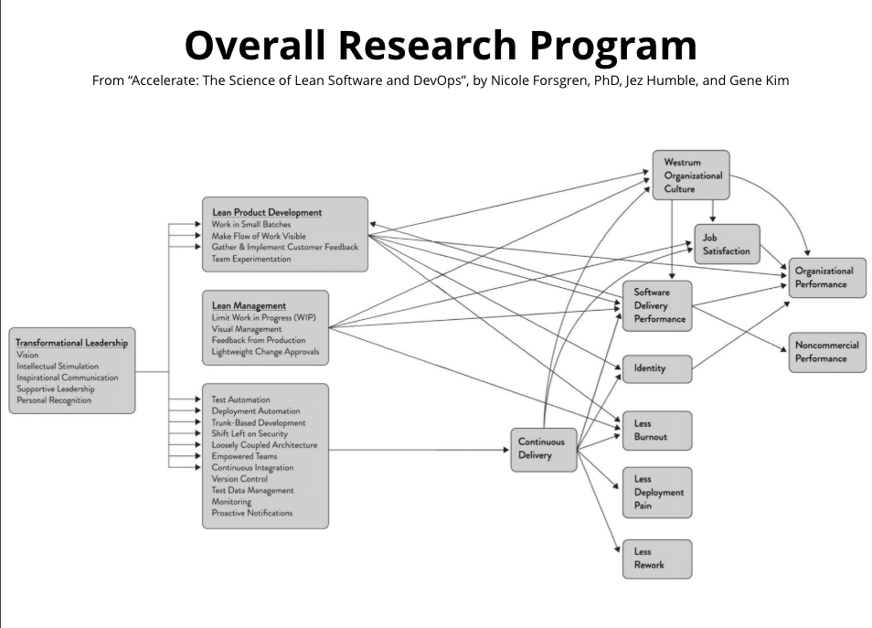

## CONTINUOUS DELIVERY CAPABILITIES

1. **Use version control for all production artifacts.** Version control is the use of a version control system, such as
   GitHub or Subversion, for all production artifacts,
   including application code, application configurations, system configurations, and scripts for automating build and
   configuration of the environment. See Chapter 4.
2. **Automate your deployment process.** Deployment automation is the degree to which deployments are fully automated
   and do not require manual intervention. See Chapter 4.
3. **Implement continuous integration.** Continuous integration (CI) is the first step towards continuous delivery. This
   is a development practice where code is regularly checked in, and each check-in triggers a set of quick tests to
   discover serious regressions, which developers fix immediately. The CI process creates canonical builds and packages
   that are ultimately deployed and released. See Chapter 4.
4. **Use trunk-based development methods.** Trunk-based development has been shown to be a predictor of high performance
   in software development and delivery. It is characterized by fewer than three active branches in a code repository;
   branches and forks having very short lifetimes (e.g., less than a day) before being merged into master; and
   application teams rarely or never having “code lock” periods when no one can check in code or do pull requests due to
   merging conflicts, code freezes, or stabilization phases. See Chapter 4.
5. **Implement test automation.** Test automation is a practice where software tests are run automatically (not
   manually) continuously throughout the development process. Effective test suites are reliable—that is, tests find
   real failures and only pass releasable code. Note that developers should be primarily responsible for creation and
   maintenance of automated test suites. See Chapter 4.
6. **Support test data management.** Test data requires careful maintenance, and test data management is becoming an
   increasingly important part of automated testing. Effective practices include having adequate data to run your test
   suite, the ability to acquire necessary data on demand, the ability to condition your test data in your pipeline, and
   the data not limiting the amount of tests you can run. We do caution, however, that teams should minimize, whenever
   possible, the amount of test data needed to run automated tests. See Chapter 4.
7. **Shift left on security.** Integrating
   security into the design and testing phases of the software development process is key to driving IT performance.
   This includes conducting security reviews of applications, including the infosec team in the design and demo process
   for applications, using preapproved security libraries and packages, and testing security features as a part of the
   automated testing suite. See Chapter 4.
8. **Implement continuous delivery (CD).** CD is a development practice where
   software is in a deployable state throughout its lifecycle, and the team prioritizes keeping the software in a
   deployable state over working on new features. Fast feedback on the quality and deployability of the system is
   available to all team members, and when they get reports that the system isn’t deployable, fixes are made quickly.
   Finally, the system can be deployed to production or end users at any time, on demand. See Chapter 4.

## ARCHITECTURE  CAPABILITIES

9. **Use a loosely coupled architecture.** This affects the extent to which a team can test and deploy their
   applications on demand, without requiring orchestration with other services. Having a loosely coupled architecture
   allows your teams to work independently, without relying on other teams for support and services, which in turn
   enables them to work quickly and deliver value to the organization. See Chapter 5.
10. **Architect for empowered teams.** Our research shows that teams that can choose which tools to use do better at
    continuous delivery and, in turn, drive better software development and delivery performance. No one knows better
    than practitioners what they need to be effective. See Chapter 5.

## PRODUCT AND PROCESS CAPABILITIES

11. **Gather and implement customer feedback.** Our research has found that whether organizations actively and
    regularly seek customer feedback and incorporate this feedback into the design of their products is important to
    software delivery performance. See Chapter 8.
12. **Make the flow of work visible through the value stream.** Teams should
    have a good understanding of and visibility into the flow of work from the business all the way through to
    customers, including the status of products and features. Our research has found this has a positive impact on IT
    performance.
    See Chapter 8.
13. **Work in small batches.** Teams should slice work into small pieces that can be completed in a week or
    less. The key is to have work decomposed into small features that allow for rapid development, instead of developing
    complex features on branches and releasing them infrequently. This idea can be applied at the feature and the
    product level. (An MVP is a prototype of a product with just enough features to enable validated learning about the
    product and its business model.) Working in small batches enables short lead times and faster feedback loops. See
    Chapter 8.
14. **Foster and enable team experimentation.** Team experimentation is the ability of developers to try out new ideas
    and create and update specifications during the development process, without requiring approval from outside of the
    team, which allows them to innovate quickly and create value. This is particularly impactful when combined with
    working in small batches, incorporating customer feedback, and making the flow of work visible. See Chapter 8.
    (The technical counterpart to this is found in Chapter 4.)

## LEAN MANAGEMENT AND MONITORING CAPABILITIES

15. **Have a lightweight change approval processes.** Our research shows that a lightweight change approval process
    based on peer review (pair programming or intrateam code review) produces superior IT performance than using
    external change approval boards (CABs). See Chapter 7.
16. **Monitor across application and infrastructure to inform business decisions.** Use data from
    application and infrastructure monitoring tools to take action and make business decisions. This goes beyond paging
    people when things go wrong. See Chapter 7.
17. **Check system health proactively.** Monitor system health, using threshold
    and rate-of-change warnings, to enable teams to preemptively detect and mitigate problems. See Chapter 13.
18. **Improve processes and manage work with work-in-process (WIP) limits.** The use of work-in-process limits to manage
    the flow of work is well known in the Lean community. When used effectively, this drives process improvement,
    increases throughput, and makes constraints visible in the system. See Chapter 7.
19. **Visualize work to monitor quality and communicate throughout the team.** Visual displays, such as dashboards or
    internal websites, used to monitor quality and work in process have been shown to contribute to software delivery
    performance. See Chapter 7.

## CULTURAL CAPABILITIES

20. Support a generative culture (as outlined by Westrum). This measure of organizational culture is
    based on a typology developed by Ron Westrum, a sociologist who studied safety-critical complex systems in the
    domains of aviation and healthcare. Our research has found that this measure of culture is predictive of IT
    performance, organizational performance, and decreasing burnout. Hallmarks of this measure include good information
    flow, high cooperation and trust, bridging between teams, and conscious inquiry. See Chapter 3.
21. **Encourage and support learning.** Is learning, in your culture, considered essential for continued progress? Is
    learning thought of as a cost or an investment? This is a measure of an organization’s learning culture.
    See Chapter 10.
22. **Support and facilitate collaboration among teams.** This reflects how well teams, which have traditionally been
    siloed, interact in development, operations, and information security. See Chapters 3 and 5.
23. **Provide resources and tools that make work meaningful.** This particular measure of job satisfaction is about
    doing work that is challenging and meaningful, and being empowered to exercise your skills and judgment. It is also
    about being given the tools and resources needed to do your job well.
    See Chapter 10.
24. **Support or embody transformational leadership.** Transformational leadership supports and amplifies the
    technical and process work that is so essential in DevOps. It is comprised of five factors: vision, intellectual
    stimulation, inspirational communication, supportive leadership, and personal recognition. See Chapter 11.

Forsgren PhD, Nicole; Humble, Jez; Kim, Gene. Accelerate: The Science of Lean Software and DevOps: Building and Scaling
High Performing Technology Organizations (pp. 225-230). IT Revolution Press. Kindle Edition. 